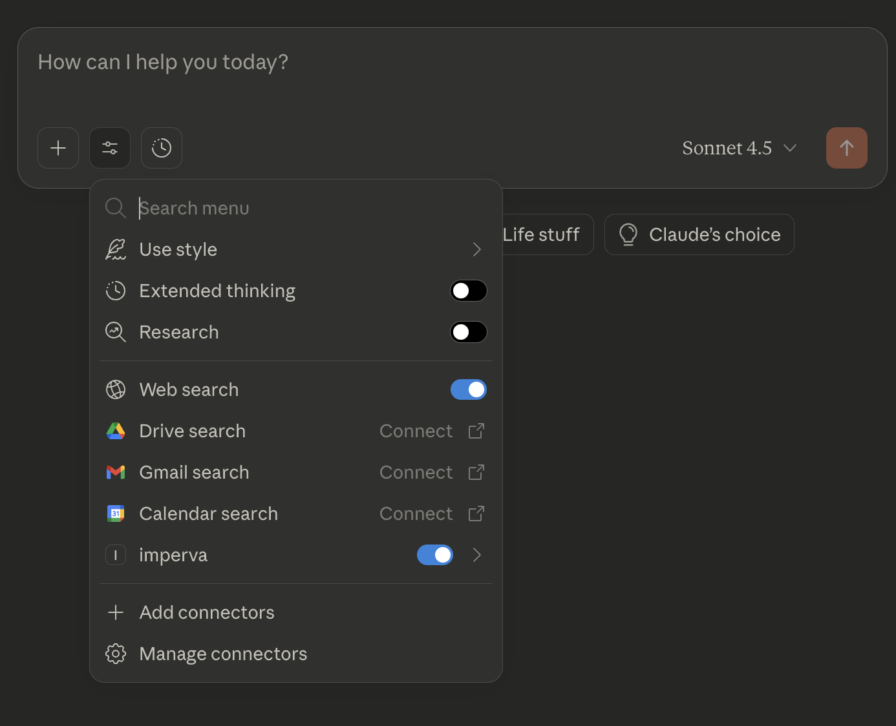

# Imperva Cloud WAF MCP Server (Beta)

[](https://github.com/ThalesGroup/imperva-cloud-WAF-MCP-server/actions/workflows/pytest-test-and-cov.yml)
[](https://codecov.io/gh/ThalesGroup/imperva-cloud-WAF-MCP-server)

A Model Context Protocol (MCP) server that enables AI assistants like Claude to interact with Imperva Cloud WAF. This integration allows you to query, analyze, and manage your Cloud WAF configuration through natural language conversations.

> **Note:** This is a beta version with read-only capabilities. Write operations are not yet supported.

## What is MCP?

The Model Context Protocol (MCP) is an open standard that enables AI assistants to securely connect to external data sources and tools. Think of it as a universal adapter that lets Claude and other AI assistants interact with your services.

## Why Use This?

Managing Cloud WAF configurations often requires:
- Navigating through multiple dashboards and interfaces
- Running complex API queries with specific filters
- Understanding relationships between sites, domains, policies, and rules
- Analyzing security configurations across multiple accounts

With this MCP server, you can ask your AI assistant questions like:
- "Show me all the security rules for my production site"
- "Which sites are using the WAF policy named 'strict-security'?"
- "List all domains that have rate limiting rules configured"
- "What's the current configuration of site ID 12345?"

Your AI assistant will use the MCP tools to fetch the information and present it in a clear, conversational format.

## Available Tools

The server provides four powerful tools for Cloud WAF management:

<table>
<thead>
<tr>
<th style="width: 10%">Tool Name</th>
<th style="width: 40%">Parameters</th>
<th style="width: 40%">Description</th>
</tr>
</thead>
<tbody>
<tr>
<td><strong>Get Sites</strong></td>
<td>
• <code>account_id</code>: Sub-account identifier<br>
• <code>names</code>: Filter by site names<br>
• <code>site_ids</code>: Filter by site IDs<br>
• <code>sub_account_ids</code>: Filter by sub-account IDs<br>
• <code>page_num</code>: Page number<br>
• <code>page_size</code>: Items per page
</td>
<td>Retrieve information about your Cloud WAF sites. Returns site details including name, ID, account ID, type, active status, CNAMEs, site status, and creation time.</td>
</tr>
<tr>
<td><strong>Get Domains</strong></td>
<td>
• <code>account_id</code>: Sub-account identifier<br>
• <code>site_ids</code>: Filter by site IDs<br>
• <code>domain_ids</code>: Filter by domain IDs<br>
• <code>names</code>: Filter by domain names<br>
• <code>page_num</code>: Page number<br>
• <code>page_size</code>: Items per page
</td>
<td>Fetch domain information for your sites. Returns domain details including name, ID, status, creation date, A records (for apex domains), and CNAME records. Note: A Cloud WAF site can have multiple domains.</td>
</tr>
<tr>
<td><strong>Get Policies</strong></td>
<td>
• <code>account_id</code>: Sub-account identifier<br>
• <code>site_ids</code>: Filter by site IDs<br>
• <code>policies_ids</code>: Filter by policy IDs<br>
• <code>sub_accounts_ids</code>: Filter by sub-account IDs<br>
• <code>names</code>: Filter by policy names<br>
• <code>policy_types</code>: Filter by policy type ("ACL")<br>
• <code>extended</code>: Get full details<br>
• <code>page_num</code>: Page number<br>
• <code>page_size</code>: Items per page
</td>
<td>Query security policies across your account. Returns complete policy information including ID, name, description, enabled status, policy type, settings, configurations, asset assignments, and sub-account permissions.</td>
</tr>
<tr>
<td><strong>Get Rules</strong></td>
<td>
• <code>account_id</code>: Sub-account identifier<br>
• <code>site_ids</code>: Filter by site IDs<br>
• <code>rules_ids</code>: Filter by rule IDs<br>
• <code>sub_accounts_ids</code>: Filter by sub-account IDs<br>
• <code>names</code>: Filter by rule names<br>
• <code>categories</code>: Filter by category ("Redirect")<br>
• <code>page_num</code>: Page number<br>
• <code>page_size</code>: Items per page
</td>
<td>Retrieve custom security rules assigned to your sites. Supports rate rules, security rules, forward rules, redirect rules, and rewrite rules. Returns detailed rule information including rule ID, site ID, name, action, enabled status, filters, and rule-specific settings (rate limiting, redirects, rewrites, etc.).</td>
</tr>
</tbody>
</table>

## Beta Scope

### Read-Only Scope

This beta is designed for inspection and analysis, operating in read-only mode.   
While you can comprehensively query and explore your configurations, creating, modifying, or deleting assets (policies, rules, sites, or domains) is not currently supported through this MCP server.   
For write operations, please use the Imperva Cloud WAF Console.    
    
These capabilities may be added in future releases. For now, use the [Imperva Cloud WAF Console](https://my.imperva.com/) to perform write operations.

### Beta Feedback - We Need Your Input!

This is a beta release, and your feedback will shape future development.

**What we're looking to learn:**

- Which queries do you run most frequently?
- What configuration tasks would you want your AI assistant to help with?
- What features would save you the most time?
- What's confusing or unclear?

Please share your feedback by [opening an issue on GitHub](https://github.com/imperva/cloudwaf-mcp/issues) or contacting your Imperva representative.

## Installation

Choose your preferred AI assistant to get started:

### Option 1: Claude Desktop

#### Prerequisites

1. **Claude Desktop** - [Download here](https://claude.ai/download)
2. **Docker Desktop** - Required to run the MCP server
   - [macOS](https://docs.docker.com/desktop/setup/install/mac-install/)
   - [Windows](https://docs.docker.com/desktop/setup/install/windows-install/)
   - [Linux](https://docs.docker.com/desktop/install/linux-install/)
3. **Imperva Cloud WAF API Credentials**
   - API ID and API Key with appropriate permissions
   - [Contact Imperva Support](https://supportportal.thalesgroup.com/csm) to obtain credentials

#### Configuration

1. Locate your Claude Desktop configuration file:
   ```bash
   # macOS/Linux
   ~/Library/Application Support/Claude/claude_desktop_config.json

   # Windows
   %APPDATA%\Claude\claude_desktop_config.json
   ```

2. If the file doesn't exist, create it:
   ```bash
   # macOS/Linux
   mkdir -p ~/Library/Application\ Support/Claude
   touch ~/Library/Application\ Support/Claude/claude_desktop_config.json

   # Windows (PowerShell)
   New-Item -Path "$env:APPDATA\Claude\claude_desktop_config.json" -ItemType File -Force
   ```

3. Add the MCP server configuration, replacing `YOUR_API_ID` and `YOUR_API_KEY` with your actual Imperva credentials:
   ```json
   {
     "mcpServers": {
       "imperva-cloudwaf": {
         "command": "docker",
         "args": [
           "run",
           "--rm",
           "--pull",
           "always",
           "-i",
           "-e", "API_ID=YOUR_API_ID",
           "-e", "API_KEY=YOUR_API_KEY",
           "ghcr.io/thalesgroup/imperva-cloud-waf-mcp-server:latest"
         ]
       }
     }
   }
   ```
   - If you already have other MCP servers configured, add the `imperva-cloudwaf` block inside the existing `mcpServers` object.

4. Restart Claude Desktop.

#### Verification

After restarting Claude Desktop, the application should start without errors. Within a few seconds, the Imperva Cloud WAF tools will appear in the MCP tools section.



---

### Option 2: VS Code with GitHub Copilot

#### Prerequisites

1. **Visual Studio Code** - [Download here](https://code.visualstudio.com/)
2. **GitHub Copilot** - Install the [GitHub Copilot extension](https://marketplace.visualstudio.com/items?itemName=GitHub.copilot) and ensure you have an active subscription
3. **Docker Desktop** - Required to run the MCP server
   - [macOS](https://docs.docker.com/desktop/setup/install/mac-install/)
   - [Windows](https://docs.docker.com/desktop/setup/install/windows-install/)
   - [Linux](https://docs.docker.com/desktop/install/linux-install/)
4. **Imperva Cloud WAF API Credentials**
   - API ID and API Key with appropriate permissions
   - [Contact Imperva Support](https://supportportal.thalesgroup.com/csm) to obtain credentials

#### Configuration

1. Open VS Code and launch the Command Palette:
   - **macOS**: `Command + Shift + P`
   - **Windows/Linux**: `Ctrl + Shift + P`

2. Type `MCP` and select **MCP: Add Server**

3. When prompted, select **Command (Stdio)** as the server type

4. Enter the following command, replacing `YOUR_API_ID` and `YOUR_API_KEY` with your actual Imperva credentials:
   ```bash
   docker run --rm --pull always -i -e API_ID=YOUR_API_ID -e API_KEY=YOUR_API_KEY ghcr.io/thalesgroup/imperva-cloud-waf-mcp-server:latest
   ```

5. Give the server a name when prompted (e.g., `Imperva`)

6. VS Code will open the `mcp.json` configuration file showing all your MCP servers. Find the **Imperva** entry and wait for its status to change to **Running**
   - This may take a few minutes while Docker downloads the image

#### Verification

Once the server status shows **Running** in the `mcp.json` file, open GitHub Copilot and test the connection by asking:
```
How many sites are there under my account in Imperva?
```

Copilot should use the Imperva MCP server to fetch and display your Cloud WAF sites.

## Usage Examples

Once configured, you can interact with your Cloud WAF account through natural language:

### Example 1: Querying Sites
```
You: Show me all active sites in my account

Your AI assistant will use the get_sites_tool to fetch and display
your sites with their current status, CNAMEs, and configuration details.
```

### Example 2: Checking Domain Configuration
```
You: What's the DNS configuration for my domain example.com?

Your AI assistant will use the get_domains_tool to find the domain and show you
the A records, CNAME, and current status.
```

### Example 3: Analyzing Security Policies
```
You: List all WAF policies that are assigned to site ID 12345

Your AI assistant will use the get_policies_tool to retrieve policies
filtered by site ID and policy type, showing you their settings and configurations.
```

### Example 4: Reviewing Security Rules
```
You: Show me all rate limiting rules for my production sites

Your AI assistant will use the get_rules_tool with the "Rates" category filter
to display rate limiting rules and their configurations.
```

### Example 5: Complex Analysis
```
You: Compare the security policies between my staging and production sites

Your AI assistant will fetch policies for both sites using the appropriate filters and
provide a comparison of their configurations.
```

## Authentication

The MCP server supports API Key authentication. Your credentials are passed securely through environment variables and are never stored or logged by the MCP server.

## Troubleshooting

### Server Not Appearing

**For Claude Desktop:**
1. Verify Docker Desktop is running
2. Check that your `claude_desktop_config.json` is valid JSON
3. Ensure API credentials are correctly set
4. Restart Claude Desktop completely
5. Check Claude Desktop logs for error messages

**For VS Code with GitHub Copilot:**
1. Verify Docker Desktop is running
2. Check that the `mcp.json` file was created correctly
3. Ensure API credentials are correctly set in the command
4. Wait for the server status to show "Running" (may take a few minutes)
5. Restart VS Code if the server doesn't appear

### Authentication Errors

1. Verify your API ID and API Key are correct
2. Ensure your API credentials have the necessary permissions
3. Check that your credentials haven't expired

### Connection Issues

1. Verify you have internet connectivity
2. Check if Docker can pull and run images
3. Ensure no firewall is blocking Docker or your AI assistant application

### Tool Errors from the MCP Server

If you start receiving errors from the MCP tools, you may be running an outdated version of the MCP server.  
Since the Docker configuration uses `--pull always`, simply restarting your AI assistant application will automatically pull the latest Docker image.

**For Claude Desktop:** Fully quit the application (ensure the process is completely killed) before restarting to ensure the old container is removed and a fresh one starts with the latest version.

**For VS Code:** Close and reopen VS Code, or use the Command Palette to reload the MCP server configuration.

## Development

### Running Locally

For development or testing, you can run the server directly with Python:

1. Clone the repository
2. Install dependencies:
   ```bash
   curl -LsSf https://astral.sh/uv/install.sh | sh
   uv sync
   ```

3. Create a `.env` file:
   ```
   API_ID=your_api_id
   API_KEY=your_api_key
   ```

4. Run the server:
   ```bash
   uv run python -m cwaf_external_mcp.server
   ```

### Running Tests

```bash
pytest tests/
```

## Contributing

Contributions are welcome! Please feel free to submit a Pull Request.

## License

This project is licensed under the Apache License - see the LICENSE file for details.  
**Warning** All the requirements listed have their own License.

## Support

For issues related to:
- **This MCP server**: Open an issue on GitHub
- **Imperva Cloud WAF API**: Contact [Imperva Support](https://supportportal.thalesgroup.com/csm)
- **Claude Desktop**: Visit [Claude Help Center](https://support.anthropic.com/)

## Learn More

- [Imperva Cloud WAF Documentation](https://docs-cybersec.thalesgroup.com/)
- [Model Context Protocol](https://modelcontextprotocol.io/)
- [Claude Desktop](https://claude.ai/download)

---

Built with [FastMCP](https://github.com/jlowin/fastmcp) and powered by the Imperva Cloud WAF API.
